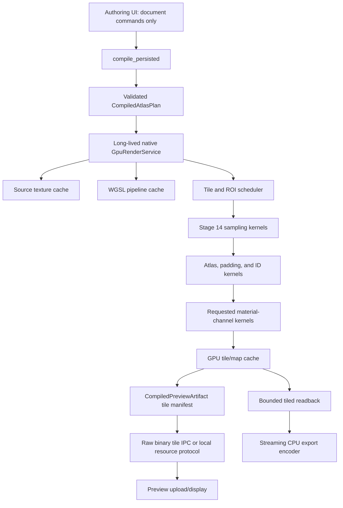

# Hot Trimmer GPU processing and rendering migration plan

## Decision

Hot Trimmer should move the production pixel-processing path from CPU raster loops to native GPU compute through
`wgpu`. This is not a rewrite of the product, document model, compiler, or preview UI. It is a replacement of the
pixel executor beneath the existing authoritative compiler.

The invariant is:

```text
TrimSheetDocument
-> compile_persisted
-> validated, immutable compiled atlas plan
-> one production GPU executor
-> compiled preview/export artifact
-> preview or export consumer
```

`compile_persisted` remains the sole live orchestration spine. The GPU executor must not become a second compiler,
renderer, layout authority, or preview-specific approximation. It executes the exact region IDs, source bindings,
crops, sampling modes, transforms, radial parameters, destination rectangles, padding rules, edge eligibility, and
requested channels compiled by `compile_persisted`.

Run the five prompts in this document sequentially, one Codex task at a time. Do not run them in parallel. Each prompt
has a visible acceptance gate and depends on the previous one.

This pack should be started after the four prompts in
`docs/manual-layout-preset-product-prompt-pack.md` are accepted. It should precede broad CPU implementation of the
material/effect stack. Existing material algorithms may be ported in Prompt 4 below; do not invent new material
algorithms as part of this migration.

## Why this migration is justified

The current production route is structurally CPU-bound and memory-heavy:

- `crates/sheet-compiler/src/persisted_pipeline.rs::compile_persisted` is the correct spine, but the SourceFrame route
  iterates regions serially and calls `synthesize_slot_material_with_guard` for each region.
- `crates/sheet-compiler/src/slot_synthesis.rs::synthesize_slot_material_with_guard` constructs dense per-pixel
  position/seam buffers, performs radial trigonometry and sampling in CPU raster loops, and processes channels
  serially.
- `crates/sheet-compiler/src/intermediate_atlas.rs::compose_intermediate_atlas` allocates full-frame channel,
  correspondence, validity, and per-pixel `RegionId` buffers and composes them with nested CPU loops.
- `apps/desktop/src-tauri/src/document_commands.rs` runs compilation off the UI thread with `spawn_blocking`, but then
  clones pixels, PNG-encodes them, Base64-encodes them, and publishes data URLs before the webview can paint them.
- `crates/preview` currently contains only a declared `wgpu` boundary; it has no GPU dependency or implementation.
- The workspace currently declares Rust 1.85. Current `wgpu` documentation declares an MSRV of 1.87, so Prompt 1 must
  make an explicit toolchain/version decision instead of casually adding the newest crate.

The existing large-source test names are not performance evidence. Some fixtures are named as 7952/8000-pixel
sources while registering small in-memory images. The GPU migration must use real dimensions and release builds for
all performance claims.

### Current memory shape

At 8192 x 8192:

| Allocation | Approximate size |
| --- | ---: |
| One RGBA8 atlas map | 256 MiB |
| Ten RGBA8 atlas maps | 2.5 GiB |
| Dense `[f32; 2]` correspondence | 512 MiB |
| One-byte validity | 64 MiB |
| Per-pixel 16-byte UUID ownership | 1 GiB |

At 16384 x 16384, one RGBA8 map alone is 1 GiB. A naive ten-map frame is 10 GiB before correspondence, ownership,
slot intermediates, source textures, PNG clones, Base64 expansion, browser decoding, or driver allocations.

Consequently, GPU acceleration and tiling are one decision, not two independent enhancements. A monolithic GPU
texture is not the 16K/24K architecture. `wgpu::Limits::defaults()` guarantees an 8192 maximum 2D texture dimension;
larger limits are adapter-dependent. The product must query capabilities and tile workloads rather than assume that a
24K texture is legal. See the official [`wgpu` crate documentation](https://wgpu.rs/doc/wgpu/) and
[`wgpu::Limits`](https://wgpu.rs/doc/wgpu/struct.Limits.html).

## Product target

The migration is complete when all of the following are true:

- A selected region can be inspected at exact 1:1 output resolution without compiling the full atlas.
- Crop, loop, planar, and planar-to-radial edits use the same authoritative shader and parameters used by export.
- The preview requests only the visible map and tiles; background refinement may publish progressively.
- 8K, 16K, and 24K output never requires all requested maps to exist simultaneously as monolithic CPU buffers.
- Five to ten source materials and at least twenty assigned patches are cached by stable content identity.
- Map switching uses already resident/cached output and does not recompile placement or decode sources.
- Cancellation and revision checks prevent old GPU work from replacing a newer document revision.
- Export uses tiled GPU execution, bounded readback, and streaming CPU encoding.
- The production pixel route is GPU-backed. A CPU implementation may remain as a small-fixture test oracle, but it is
  not a silent production fallback that makes performance unpredictable.

### Performance targets

These are release-build targets on a documented midrange discrete GPU, measured with real source dimensions. Prompt 1
must capture adapter, driver, CPU, RAM, VRAM, source formats, channel count, and exact workload with every result.

| Interaction | Target |
| --- | ---: |
| Warm selected-region 1:1 refresh (1024-2048 output texels) | 50-250 ms |
| Warm pan/zoom tile request | <= 100 ms to first updated tile |
| Warm map switch to cached map | <= 50 ms |
| Cold 512 complete-sheet preview | <= 1 s |
| Warm 1024 complete-sheet preview | <= 500 ms |
| Cold 8K Base Color | 2-6 s |
| Warm 8K Base Color | 1-3 s |
| Warm requested 8K material set | 2-8 s, hardware/channel dependent |
| 16K/24K preview | progressive first tile <= 500 ms; no monolithic wait |

These are qualification gates, not promises that should be achieved by reducing quality or bypassing authoritative
sampling. If a target is missed, telemetry must show whether decode, upload, dispatch, readback, encoding, IPC, or
webview paint is responsible.

## Non-negotiable architecture

### Preserve

- `TrimSheetDocument` and its command/undo/persistence authority.
- Stable `RegionId`, `RegionBinding`, `SourceSetId`, `PatchId`, crop, grid, continuity, radial, and edge semantics.
- `compile_persisted` as the only live orchestration entry point.
- Exact sampling behavior established by the manual-layout product prompt pack.
- Existing cache identities where they are correct; strengthen keys rather than create parallel caches.
- CPU source-file decoding initially. Decode and GPU execution are separate bottlenecks and can be optimized
  independently.
- CPU file encoding at the final export boundary, fed by bounded tile readbacks.

### Replace in production

- CPU construction of full-frame position, seam, correspondence, ownership, and validity arrays.
- Serial per-region CPU rasterization and serial per-channel sampling.
- CPU atlas composition, padding/dilation, structural profile composition, and map derivation once each corresponding
  GPU phase is accepted.
- PNG + Base64 data URLs in the interactive preview hot path.
- Full-atlas recompilation for a selected-region edit or a viewport pan.
- Per-pixel UUID ownership. Store a compact `u32` region-table index in the GPU ID target and resolve it through the
  artifact's stable `RegionId` table.

### Do not create

- A TypeScript/WebGPU renderer.
- A second native renderer that independently resolves project state.
- A preview-only sampling implementation.
- A GPU layout solver or GPU document model.
- A silent CPU production fallback.
- A hardcoded “GPU texture equals final atlas” assumption.

## Target architecture



### 1. Compiler/executor boundary

Refactor `compile_persisted` internally into two responsibilities without changing its authority:

1. Compile and validate immutable instructions.
2. Submit those instructions to the configured production pixel executor.

An illustrative internal contract is:

```rust
struct CompiledAtlasPlan {
    document_revision: u64,
    topology_hash: Digest,
    appearance_hash: Digest,
    output_size: PixelSize,
    profile: RenderProfile,
    requested_maps: MapSet,
    region_table: Vec<CompiledRegionCommand>,
    source_table: Vec<CompiledSourceCommand>,
    tile_request: TileRequest,
    diagnostics: Vec<Diagnostic>,
}

struct CompiledRegionCommand {
    region_id: RegionId,
    compact_region_index: u32,
    source_key: SourceTextureKey,
    source_crop: SourceCrop,
    destination: PixelRect,
    sampling_mode: SamplingMode,
    source_to_slot: SamplingTransform,
    radial: Option<CompiledRadialParameters>,
    continuity: RegionContinuity,
    padding: PixelPadding,
    edge_eligibility: EdgeEligibility,
}
```

Names may follow existing repository conventions. The essential rule is that the plan contains exact values and
stable identities; the GPU service never reaches back into `TrimSheetDocument`, raw layout state, UI state, or
defaults.

The plan and each command need deterministic hashes so Stage 14 output, atlas tiles, and derived maps can be cached by
exact upstream identity.

### 2. Long-lived GPU service

Use `crates/preview` as the existing declared GPU/application-resource boundary unless direct inspection shows a
better existing home. Do not create a new orchestration crate merely to hold `wgpu`.

The native Tauri application should own one long-lived service containing:

- `wgpu::Instance`, selected `Adapter`, `Device`, and `Queue`.
- Adapter capabilities and the qualified format/tile policy.
- Precompiled compute/render pipelines and bind-group layouts.
- Source texture cache keyed by source digest, oriented dimensions, decode/color-space version, and map role.
- Rendered tile cache keyed by compiled plan identity, map, mip, tile rectangle, halo, and quality profile.
- Reusable staging/readback buffers.
- Bounded VRAM accounting and LRU eviction.
- Monotonic generation/revision tracking, cancellation, uncaptured-error handling, and device-loss recovery.
- Per-pass GPU timestamps where supported and CPU wall-clock fallbacks where not.

The service must live across preview requests. Recreating the device, pipelines, or source textures per drag would
erase the expected speedup.

### 3. GPU work division

Good GPU workloads:

- Direct crop, planar, explicit loop X/Y/XY, and planar-to-radial coordinate generation.
- Bilinear sampling, registered cross-channel sampling, seam blending, and validity.
- Atlas writes, compact Region ID, padding/dilation, and mip generation.
- Hotspot masks, distance-to-edge/profile evaluation, height composition, normal derivation, and existing scale-aware
  material effects.
- Roughness, AO, Metallic, and other requested channel composition.

CPU responsibilities that remain:

- Document commands, preset loading, validation, stable IDs, plan compilation, cache-key construction, diagnostics,
  and scheduling policy.
- Source file discovery and decode initially.
- Final PNG/TIFF/etc. encoding and filesystem I/O.
- Small deterministic CPU reference fixtures for GPU parity tests.

### 4. Formats and memory policy

- Base Color: sRGB-capable RGBA8 storage with explicit linear/sRGB behavior at shader boundaries.
- Height/intermediate math: use a qualified single-channel float format such as R16Float/R32Float where supported;
  do not collapse the working range into RGBA8.
- Normal: use float intermediates where needed and pack only at publication/export.
- Roughness/AO/Metallic/masks: single-channel formats unless the output contract explicitly packs them.
- Region ID: `u32` compact index plus an artifact-level `u32 -> RegionId` table.
- Correspondence: optional diagnostic output or tile-scoped buffer, never an unconditional full-atlas allocation.
- Requested-map generation: do not generate ten maps because the preview requested one.
- Readback: only visible/published tiles for preview; bounded sequential tiles for export.

### 5. Tiling and exact preview

All output profiles use the same plan and shader semantics. They differ only in requested extent, mip/quality, and
publication behavior.

- **Viewport/selected-region 1:1:** render exact output texels for the visible region or viewport. This is the primary
  precision-authoring view for radial and crop edits.
- **Draft sheet:** render a complete low-resolution atlas for navigation.
- **Refinement sheet:** progressively replace draft tiles at higher resolution.
- **Authoritative export:** schedule all output tiles, include operation-specific halos, read back and stream them in
  deterministic order.

Tile size must be selected from adapter limits and memory budget, normally 1024 or 2048 rather than hardcoded. Each
kernel declares the halo it needs. Sampling may need a small filter halo; edge profiles, AO, weathering, and mip
generation may need larger halos. Only the valid interior is published/encoded so adjacent tiles are seamless.

### 6. Preview contract

The preview consumes a compiled artifact. It never calls stages itself.

```text
CompiledPreviewArtifact {
    document revision and draft ID,
    topology/appearance/plan hashes,
    output dimensions and profile,
    requested and available maps,
    stable RegionId table,
    region metadata,
    tile manifest [map, mip, tile rect, valid rect, generation, binary resource],
    diagnostics,
    decode/upload/dispatch/readback/publication/paint timings,
    source/tile/pipeline cache hit and miss counts,
    adapter/backend/driver and memory telemetry
}
```

Metadata may remain JSON. Pixel payloads must not. Tauri supports raw byte invoke responses (`Raw(Vec<u8>)`), so the
interactive path can use raw binary responses or a scoped local resource protocol rather than Base64-in-JSON. See
[`InvokeResponseBody`](https://docs.rs/tauri/latest/tauri/ipc/enum.InvokeResponseBody.html).

### 7. Cancellation and correctness

- Every request has a document revision, draft ID, and cancellation generation.
- The scheduler stops submitting obsolete tiles and refuses to publish completed obsolete work.
- Cache entries are immutable and keyed by exact compiled identities; current UI selection is not a cache key.
- GPU errors are typed diagnostics. Never replace a failed authoritative GPU result with a stale texture.
- Device loss reconstructs device-owned caches from CPU metadata/source identities and reports progress.
- GPU parity permits defined numeric/filter tolerances, not unrelated visual approximations.
- Normal convention, color space, alpha, radial seams, padding, and edge eligibility have explicit golden tests.

## Delivery sequence

| Prompt | Product result | Depends on | Review gate |
| --- | --- | --- | --- |
| 1 | Real 8K baseline and stable compiler/executor contract | Manual layout prompts accepted | Reproducible trace and unchanged pixels |
| 2 | Stage 14 Base Color samples on the GPU | Prompt 1 | Truthful direct/loop/radial parity and faster real 8K |
| 3 | GPU atlas + exact tiled preview + binary publication | Prompt 2 | 1:1 edits are interactive; no PNG/Base64 hot path |
| 4 | Requested material maps are generated/composed on GPU | Prompt 3 | Correct map set, registration, normals, profiles, and map switching |
| 5 | 16K/24K tiled export and production hardening | Prompt 4 | Bounded memory, multi-source export, device recovery, CPU route retired |

Estimated implementation effort after the manual-layout product work is accepted:

| Prompt | Realistic engineering effort |
| --- | ---: |
| 1 | 3-5 days |
| 2 | 7-12 days |
| 3 | 7-12 days |
| 4 | 10-18 days |
| 5 | 8-15 days |
| **Total** | **35-62 engineering days** |

The critical path is Prompt 1 -> Prompt 2 -> Prompt 3. Prompt 4 should not begin while preview publication still
forces full-frame CPU copies. Prompt 5 cannot be proven with synthetic small fixtures.

---

## Prompt 1 - Establish the real-scale baseline and GPU execution contract

```text
Implement GPU Migration Prompt 1: establish a real 8K performance/memory baseline and introduce the immutable
compiler-to-render-executor contract without changing output pixels.

Read AGENTS.md; docs/gpu-rendering-migration-plan.md; docs/manual-layout-preset-product-prompt-pack.md; the current
diff; compile_persisted and the SourceFrame/manual-layout branch in
crates/sheet-compiler/src/persisted_pipeline.rs; crates/sheet-compiler/src/slot_synthesis.rs;
crates/sheet-compiler/src/intermediate_atlas.rs; crates/preview; crates/render-core; the Stage 14 Tauri command and
publication code in apps/desktop/src-tauri/src/document_commands.rs; IPC contracts; and the preview consumer. Do not
use subagents. Preserve unrelated worktree changes.

Architecture constraints:
- compile_persisted remains the sole live orchestration spine.
- Do not add a second renderer, compiler, TypeScript pixel path, or preview approximation.
- Separate plan compilation from pixel execution internally. Add one immutable, deterministic CompiledAtlasPlan (or
  repository-consistent equivalent) containing exact source, crop, transform, sampling/radial, destination, padding,
  region identity, requested-map, profile, and tile-request data.
- Add one executor interface that consumes only that plan and prepared source resources. Its implementation for this
  prompt remains the existing CPU output, so pixel output must be unchanged.
- The executor must not read TrimSheetDocument, UI state, global defaults, or legacy regions.
- Define deterministic plan/source/region/tile cache identities and typed diagnostics.
- Decide and document a wgpu/toolchain version compatible with the workspace. Current workspace Rust is 1.85 while
  current wgpu documentation declares MSRV 1.87; either deliberately upgrade the workspace toolchain or select and
  pin a supported wgpu version. Do not let Cargo choose accidentally.
- Add the long-lived native GPU capability-service skeleton in the existing preview/render boundary. It may enumerate
  an adapter/device and publish capability telemetry, but it must not alter pixels in this prompt.

Measurement requirements:
- Add a release benchmark/diagnostic harness using actual 7952x4016 or larger decoded pixels, not a tiny image with an
  8K filename. Keep huge assets out of ordinary unit-test cost if necessary by generating/locating them in a dedicated
  ignored benchmark.
- Record source dimensions/format/count, patch/region count, requested maps, output size, profile, decode count,
  upload bytes, full-frame allocations, peak RSS if available, wall timings for snapshot, decode, plan, Stage 14,
  compose, encode, IPC preparation, and UI paint, plus cache hits/misses and thread usage.
- Capture one cold and two warm real-8K Base Color runs in release mode and save the machine/hardware metadata with the
  trace.
- Correct misleading test names/claims that imply real 8K coverage while using tiny buffers.

Acceptance:
- Existing manual-layout direct/loop/radial Base Color pixels and stable IDs remain unchanged.
- Every production Stage 14 request passes through the new immutable plan/executor boundary via compile_persisted.
- The baseline trace makes the 25-second workload reproducible and attributes its time and memory.
- GPU adapter/backend/driver, limits, supported formats, timestamp support, and selected tile policy are visible in
  diagnostics.
- No user-visible GPU acceleration is claimed yet.

Focused verification command:
cargo test -p hot-trimmer-sheet-compiler gpu_execution_contract

Run that one command, make at most one correction pass if it fails, rerun it, and stop. Report the exact benchmark
command separately because the real-8K benchmark is not an ordinary unit test. Do not begin Prompt 2.
```

---

## Prompt 2 - Execute authoritative Stage 14 Base Color on the GPU

```text
Implement GPU Migration Prompt 2: make the existing compile_persisted Stage 14 Base Color route execute direct,
looped, planar, and planar-to-radial sampling on a long-lived native wgpu service.

Read AGENTS.md; docs/gpu-rendering-migration-plan.md; the accepted Prompt 1 report and trace; the compiled plan and
executor contract; SamplingPlan/RegionBinding/manual region semantics; slot_synthesis.rs; the current Stage 14 cache;
crates/preview; crates/render-core; and native application state. Do not use subagents.

Required implementation:
- Add one production wgpu executor beneath compile_persisted. Reuse the existing preview/render boundary; do not add a
  second orchestration spine.
- Keep one Instance/Adapter/Device/Queue alive for the application lifetime and cache WGSL pipelines/bind groups.
- Add a bounded GPU source-texture cache keyed by digest, oriented dimensions, decoder/color-space version, and channel
  role. Upload a source once per exact identity.
- Implement the exact compiled Base Color modes already supported by the product: DirectCrop, explicit LoopX/LoopY/
  LoopXY where legal, planar sampling, and planar-to-radial mapping with its exact center/radius/angle/warp/seam
  parameters. Unsupported pairs fail with typed diagnostics; they never fall back to stretch or centered sampling.
- Preserve aspect behavior, crop coordinate conventions, orientation, bilinear/filter policy, alpha, color space,
  radial seam behavior, and cross-channel-ready transform identity.
- Submit region commands in GPU batches. Do not allocate CPU full-frame position/seam arrays or call the serial CPU
  raster loop on the production GPU route.
- Keep the CPU implementation only as a deterministic small-fixture parity oracle while the migration is in progress.
  A developer comparison switch may run both paths, but production must not silently fall back when GPU execution
  fails.
- Thread cancellation/revision generations through command submission and publication.

Acceptance:
- Pixel/golden parity is exact where integer/direct sampling permits and within one documented filter/color tolerance
  where GPU filtering differs.
- One test covers each mode, crop boundaries, non-square oriented sources, alpha, and radial seam/warp.
- Stable RegionId, source ID, crop, destination, and plan hashes match the CPU reference.
- A real 8K manual-layout Base Color run is measured cold and warm. Warm target is 1-3 seconds and cold target is 2-6
  seconds on the documented qualification GPU. If missed, report pass-level telemetry; do not hide it by lowering the
  requested output.
- The UI still consumes the existing artifact in this prompt. PNG/Base64 cost may remain and must be reported, not
  mistaken for GPU kernel time.

Focused verification command:
cargo test -p hot-trimmer-sheet-compiler gpu_stage_14_base_color

Run that one command, make at most one correction pass, rerun it, and stop. Perform one native visual comparison of a
direct crop, explicit loop, and radial region at the same document revision. Do not begin Prompt 3.
```

---

## Prompt 3 - Move atlas composition and exact interactive preview to GPU tiles

```text
Implement GPU Migration Prompt 3: GPU atlas composition, padding/Region ID, exact ROI/tile preview, and binary pixel
publication through the existing compile_persisted artifact route.

Read AGENTS.md; docs/gpu-rendering-migration-plan.md; accepted Prompt 1-2 reports; intermediate_atlas.rs; GPU Stage 14
executor/cache; document_commands.rs publication; IPC contracts; source-first-app.tsx preview controller; and the
preview canvas/image upload code. Do not use subagents.

Required implementation:
- Move atlas destination writes, validity, overlap validation, padding/dilation, and Region ID generation to GPU
  passes using the exact compiled destination rectangles.
- Replace per-pixel UUID ownership with a compact u32 region index and artifact-level stable RegionId table.
- Make dense correspondence optional diagnostic output and tile-scoped. Do not allocate it for ordinary preview.
- Add a capability-selected tile scheduler, normally 1024/2048, with valid rect and halo. The scheduler supports full
  draft, progressive refinement, viewport tiles, and selected-region exact 1:1 requests using the same shaders and
  plan as export.
- Cache GPU output by exact plan/map/mip/tile/halo/profile identity. Panning, zooming, selection, and map switching must
  not invalidate unrelated tiles.
- Replace PNG + Base64 data URLs in the interactive hot path with raw binary byte responses or a scoped local resource
  protocol. Metadata remains in the CompiledPreviewArtifact; pixels are referenced by its tile manifest.
- The preview consumes the artifact/tile manifest and uploads/displays tiles. It must not invoke Stage 14 or reproduce
  crop/radial math.
- Publish progressive tiles only when their document revision/draft ID is current. Coalesce drag requests and stop
  publishing obsolete generations.
- Keep PNG/TIFF encoding out of interactive preview. It remains an export concern.

Acceptance:
- A selected direct or radial region can be viewed at exact 1:1 output texels without a full 8K compile.
- Warm selected-region refresh is 50-250 ms; warm pan to a cached tile is <=100 ms; cached map switch is <=50 ms on the
  qualification machine.
- Full draft first display is <=1 second and refinement arrives progressively.
- No Base64 pixel payload, full-atlas PNG encode, full-frame UUID array, or mandatory full-frame correspondence buffer
  exists in the preview hot path.
- Padding has no black/transparent seams and writes never cross a region's authorized padded destination.
- Revision/cancellation tests prove an old tile cannot overwrite a new edit.
- Draft, 1:1 ROI, and authoritative output agree at common texels within the Prompt 2 tolerance.

Focused verification command:
npm.cmd run test --workspace @hot-trimmer/desktop -- gpu-tiled-preview

Run that one command, make at most one correction pass, rerun it, and stop. Complete one native visual walkthrough at
512 navigation plus 1:1 radial inspection. Do not begin Prompt 4.
```

---

## Prompt 4 - Generate and compose requested material maps on the GPU

```text
Implement GPU Migration Prompt 4: extend the same compile_persisted GPU tile pipeline from truthful Stage 14 sampling
through the existing structural/material channel logic for only the maps requested by preview or export.

Read AGENTS.md; docs/gpu-rendering-migration-plan.md; accepted Prompt 1-3 reports; current height/profile/mask, normal,
roughness, AO, Metallic, Region ID, and effect implementations; effect-plan and edge-eligibility contracts; old dead
compositor functions identified for extraction; GPU formats; and the CompiledPreviewArtifact. Do not use subagents.

Scope:
- Port existing algorithms; do not design new material algorithms, revive a dead orchestrator, or add another renderer.
- Execute the authoritative order:
  sampled slot material
  -> hotspot-local structural/profile mask
  -> structural height
  -> material + structural height
  -> generated/composed normal
  -> roughness
  -> AO
  -> Metallic if requested
  -> Region ID
  -> atlas channel tiles.
- Extract reusable math from dead code into GPU kernels or shared pure contracts. Never call its old top-level
  compositor.
- Cross-channel source maps use the exact Stage 14 source/crop/transform/radial identity.
- Edge/profile/effect coordinates are hotspot-local and scale-aware. Continuity/loop eligibility suppresses forbidden
  left/right or top/bottom edges. No effect writes outside the hotspot plus declared tile halo.
- Honor OpenGL/DirectX normal convention explicitly and preserve height range in a float working format.
- Generate only requested maps. A Base Color edit must not generate ten maps, and a map switch must reuse cached source,
  Stage 14, structural, and map tiles when their identities match.
- Keep intermediate maps GPU-resident and use compact single-channel formats where appropriate. Read back only tiles
  required by preview/export.
- Include one existing deterministic edge/chip/weathering effect only if its authoritative effect plan already exists.
  Do not broaden this prompt into an effect-library redesign.

Acceptance:
- The compiled artifact can publish Base Color, Height, Normal, Roughness, AO, Metallic, and Region ID from the same
  region IDs and atlas rectangles.
- A golden proves structural height is visible, normals derive from the composed height, channel transforms remain
  registered, looped edges are suppressed correctly, and Region ID resolves every pixel to the stable table.
- Map-request telemetry proves unrequested kernels and readbacks did not run.
- Cached map switching is <=50 ms.
- A warm requested 8K material set completes in 2-8 seconds on the qualification machine, with exact channels and
  hardware recorded. Failure to meet the target produces per-kernel/readback telemetry, not reduced quality.
- CPU material raster loops are no longer on the production path for migrated channels; CPU small fixtures remain the
  parity oracle only.

Focused verification command:
cargo test -p hot-trimmer-sheet-compiler gpu_material_map_pipeline

Run that one command, make at most one correction pass, rerun it, and stop. Visually inspect all requested maps on one
layout containing planar, looped, and radial regions. Do not begin Prompt 5.
```

---

## Prompt 5 - Qualify 16K/24K tiled production, export, and failure handling

```text
Implement GPU Migration Prompt 5: production hardening for bounded-memory 8K/16K/24K preview and export across
multiple sources, including tiled readback/encoding, cache budgets, device loss, and retirement of the CPU production
executor.

Read AGENTS.md; docs/gpu-rendering-migration-plan.md; accepted Prompt 1-4 reports; export crate; image encoders; project
save/reopen; GPU scheduler/caches; IPC artifact; cancellation/diagnostics; and adapter capability code. Do not use
subagents.

Required implementation:
- Make every authoritative output larger than the safe adapter/VRAM budget a tiled workload. Never require a 16K or
  24K monolithic GPU texture, CPU atlas buffer, or all-map allocation.
- Calculate tile size, halo, concurrent tile count, source residency, output residency, and staging-pool size from
  adapter limits and explicit memory budgets.
- Support five to ten source materials, twenty or more patch bindings, and mixed direct/looped/radial regions with
  digest-based source reuse and bounded LRU eviction.
- Read back completed authoritative tiles into a bounded staging pool and stream them to the existing PNG/TIFF/etc.
  encoder in deterministic image order. Do not Base64 export pixels or retain all channel frames in RAM.
- Preserve seamless filters, profiles, AO/effects, padding, and mips across tile boundaries using declared halos and
  valid interiors.
- Add progress by map/tile, cancellation between dispatch/readback/encode steps, resumable/reusable cache identities
  where safe, and clear disk-write failure diagnostics.
- Handle unsupported adapters and device loss explicitly. Recreate device-owned resources from immutable CPU plan and
  source identities, then resume or fail cleanly without publishing stale output.
- Define the supported GPU floor and user-facing unsupported-device policy. Do not silently route a 24K export through
  the old CPU executor.
- Remove the CPU executor from the production selection path after parity and qualification pass. Retain only the
  focused CPU reference used by tests, clearly marked non-production.
- Add release qualification across at least one integrated and one discrete GPU when hardware is available. Record
  backend, driver, limits, CPU/RAM/VRAM, source set, maps, tiles, timings, peak RSS/VRAM, cache behavior, and output
  hashes/tolerances.

Acceptance:
- Real 8K, 16K, and 24K exports complete with bounded reported CPU and GPU memory; first 16K/24K preview tile appears
  within 500 ms on the qualification discrete GPU.
- A multi-source/multi-patch fixture proves no source ownership is substituted and save/reopen produces the same plan
  identities and output.
- Tile-boundary goldens show no seams in Base Color, Height, Normal, Roughness, AO, or padding.
- Cancellation, stale revision, cache eviction, disk failure, and simulated device-loss tests are deterministic.
- Export and preview consume the same compiled plan and shader semantics.
- No production call reaches CPU slot synthesis/atlas composition for migrated channels.
- The final report compares all measurements to the Prompt 1 baseline and lists any remaining non-GPU costs.

Focused verification command:
cargo test -p hot-trimmer-export gpu_tiled_export

Run that one command, make at most one correction pass, rerun it, and stop. Run the separate release qualification
matrix and provide its artifacts/commands; do not disguise it as a unit test.
```

## Final acceptance checklist

Do not call the migration complete until a reviewer can answer yes to all of these:

- Does every pixel-producing request still enter through `compile_persisted`?
- Does the GPU executor consume exact compiled instructions without reaching back into project/UI state?
- Is there exactly one production sampling/composition implementation?
- Can a radial region be inspected at 1:1 within 250 ms without a full-atlas compile?
- Are preview pixels transmitted without PNG/Base64 in the hot path?
- Are only requested maps generated and read back?
- Are 16K/24K workloads tiled regardless of permissive adapter limits?
- Are Region IDs compact on GPU but stable and lossless in the artifact?
- Are caches keyed by exact upstream identities and bounded by memory policy?
- Do cancellation, stale revisions, and device loss fail without stale publication?
- Do real-resolution release benchmarks, rather than synthetic filenames, prove the performance claims?
- Is the old CPU production executor retired rather than retained as an unpredictable fallback?

