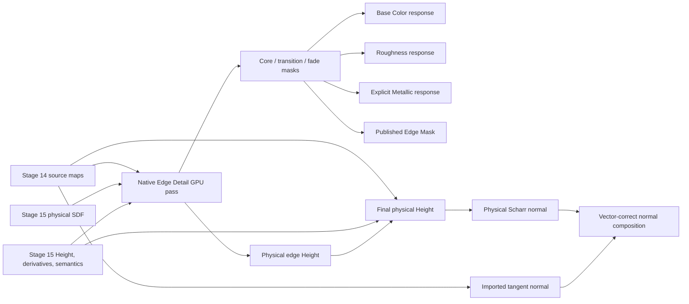

# Hot Trimmer Native Edge Detail / Edge Wear Implementation Plan

Status: implementation-ready plan  
Date: 2026-07-21  
Scope: native Hot Trimmer authoring, GPU preview, persistence, export maps, and focused validation  
Primary verification command: `npm.cmd run test --workspace @hot-trimmer/desktop -- mvp-edge-wear`

## 1. Outcome

Hot Trimmer must generate convincing trim-edge bevel, wear, breakup, color fading, Height, Normal, Roughness, and
explicit Metallic contributions without requiring Blender at authoring or preview time.

The recommended implementation is a dedicated native **Edge Detail GPU pass** that consumes the physical signed
distance field (SDF), structural Height, derivatives, and semantic occupancy already produced by Stage 15. Blender's
`HotBox_1.0.blend` remains a visual and behavioral reference only.

Do not continue improving the current one-mask rectangle-border implementation as the production design. It can be
used temporarily while the new pass is brought online, but it must be removed from the source-sampling shader after
the new pass is accepted.

This work is a narrow Edge Wear vertical slice in the architectural position intended for Stage 18. It does **not**
install or complete the full Stage 18 compiler and must not report Stage 18 as installed.

## 2. User-visible target

Given a trim atlas containing rectangular panels, thin horizontal and vertical strips, adjacent regions, and radial
regions, Hot Trimmer should produce:

- smooth rounded edge slopes rather than one-pixel lines;
- coherent but interrupted wear around every eligible region;
- broad-to-tight edge fading comparable to the HotBox reference;
- deterministic chips and breakup that do not look like block cells;
- source-aware microdetail driven primarily by source Height and optionally by high-passed luminance;
- final Normal generated from the composed physical Height;
- independently controlled Base Color, Roughness, and explicit-only Metallic responses;
- the same physical width and perceived profile at 512, 1024, 2048, and 4096 output sizes;
- immediate automatic preview publication after applying or editing Edge Detail;
- global targeting that affects every eligible region even when no region is selected.

## 3. What the HotBox reference actually does

The `HotBox_1.0.blend` file was inspected directly from its Blender 4.5 datablocks. It contains:

- a `BakeCam`;
- six `trim_*` objects and six `TrimTemplate_*` objects;
- fifteen mesh datablocks;
- a 69-node `HotBox_1.0` node group;
- separate `Edge`, `normal_edge_mask_2`, `Pixelate`, and `Sigmoid` groups;
- outputs for ID, Diffuse, Metallic, Roughness, Normal, and EdgeMask.

The reference is a geometry-aware shading and baking rig, not a flat texture filter.

### 3.1 Reference edge-mask chain

The `Edge` group performs the following work:

1. Feed source texture detail into a Bump operation.
2. Feed the resulting normal into Blender's Bevel shader.
3. Compare Bevel Normal with Geometry Normal using a dot product.
4. Remap the narrow `0.999 -> 1.0` normal-deviation range into an edge signal.
5. Distort the signal with coherent 4D noise (Scale 16, Detail 16, Roughness 0.66 in the saved group).
6. Apply coverage/threshold mapping and strength.
7. Evaluate the group four times with different width and strength scales.
8. Combine masks with Lighten/max-style mixing.

The top-level group then uses progressively wider masks to create core, transition, and outer fade responses. It also
creates a separate normal-deviation mask through absolute vector difference, vector length, a Float Curve, and a
Sigmoid function.

### 3.2 Reference channel chain

- Diffuse uses several nested masks with different HSV Value responses rather than one masked color change.
- Roughness and Metallic use the final combined edge signal but retain independent response controls.
- Normal combines source bump detail with the Bevel normal.
- EdgeMask exposes the combined, remapped edge signal.

### 3.3 Reference control semantics

The saved group demonstrates that the visible labels do not match the current Hot Trimmer semantics:

| Reference control | Saved range/behavior | Current Hot Trimmer mismatch |
|---|---|---|
| Coverage | `0..20`, multiplied by `0.01` internally | Clamped to `0..1` |
| Strength | Applied through mask remapping and internal scale | Simple final mask multiplier |
| Texture | Source signal used by bump and edge formation | Procedural noise is independent of source detail |
| Value | HSV multiplier, values up to `3` | Additive offset |
| Bevel Radius | Central structural parameter | Missing from persisted intent |
| Normal Edge Detail | Controls normal/bump edge contribution | Missing from persisted intent |
| Rough/Metal offsets | Independent masked channel responses | Only a single shared mask response |

Hot Trimmer should not copy the confusing numeric ranges blindly. It should reproduce the behavior using explicit
physical and normalized controls.

## 4. Why the current implementation fails visually

The current implementation embeds Edge Wear fields in the Stage 14 source-sampling `RegionCommand`:

- `crates/preview/src/gpu_base_color.wgsl:26-83`
- `crates/sheet-compiler/src/atlas_executor.rs:1249-1305`

It then:

1. Computes minimum distance to the four sides of a rectangular semantic region.
2. Warps that distance with generated noise.
3. Produces one mask from edge fade, coverage noise, chip detail, and strength.
4. Adds one constant signed Height amplitude through that mask.
5. Uses the same mask for one HSV transformation and scalar offsets.

Relevant code:

- `crates/preview/src/gpu_base_color.wgsl:174-226`
- `crates/preview/src/gpu_base_color.wgsl:409-414`
- `crates/preview/src/gpu_base_color.wgsl:588-627`

This creates a masked step, not a rounded bevel profile. Normal derivation sees the step and produces harsh bright
lines. Additional noise can make the boundary less regular, but it cannot create the missing structural slope,
multi-band fade, or source-aware normal detail.

The current UI and contract also enforce incompatible semantics:

- `packages/ipc-contracts/src/document-contracts.ts:249-264`
- `apps/desktop/src/feedback-workbench.tsx:232-236`

## 5. Existing Hot Trimmer foundation to reuse

Stage 15 already publishes exactly the physical fields the new pass needs:

```text
height_out        r32float
sdf_out           r32float
semantics_out     r32float
derivative_x_out  r32float
derivative_y_out  r32float
```

See `crates/preview/src/gpu_structural_profile.wgsl:39-53` and `:124-202`.

The Stage 15 evaluator already supports:

- rectangular and radial SDFs;
- eligible-edge masks;
- physical slot dimensions;
- physical profile widths and amplitudes;
- analytical derivatives;
- occupancy and raised/recessed/cap/groove semantics;
- bounded supersampling.

Do not re-derive a lower-quality rectangle distance in Base Color. Bind and consume the authoritative Stage 15 fields.

The intended final composition is already documented:

```text
final_height =
    material_height
  + structural_profile_height
  + detail_height
  + weathering_height
```

See `docs/hot-trimmer-v1-full-algorithm-stack-revised.md:1757-1785`.

## 6. Recommended native architecture



### 6.1 Pass ownership

Create a dedicated `gpu_edge_detail.wgsl` compute pass and a corresponding compiled command/resource boundary. It may
be described as `EdgeDetailMvpV1` in code and telemetry. Do not call it the complete Stage 18 effect plan.

Inputs:

- Stage 15 physical SDF;
- Stage 15 structural Height and semantics;
- stable region/slot identity and role;
- physical slot size and meters-per-pixel X/Y;
- optional source Height;
- optional source luminance fallback;
- one versioned `EdgeDetailIntentV1`;
- deterministic seed.

Outputs:

- core mask;
- transition/wear mask;
- outer fade mask;
- authoritative combined Edge Mask;
- signed physical edge Height contribution.

The masks may be stored together in a multi-channel float texture when the adapter supports the selected storage
format. The physical Height output remains `r32float`. Capability selection and fallback must be explicit and included
in telemetry; do not silently change precision.

### 6.2 Requested-map dependencies

The requested-map graph must be truthful:

```text
Base Color -> registered source + Stage 15 SDF/semantics + edge-detail mask + color composition
Edge Mask  -> Stage 15 SDF/semantics + edge-detail mask
Height     -> material Height + Stage 15 structural Height + edge-detail Height + final Height
Normal     -> final Height + authored Normal + vector-correct composition
Roughness  -> registered source/default + edge-detail mask + scalar composition
Metallic   -> registered source/default + edge-detail mask + explicit-metal composition
```

If Edge Detail is disabled, its pass must dispatch zero work and downstream maps must remain byte-identical to the
non-Edge-Detail result.

### 6.3 Cache identity

CPU plan identity must include:

- exact persisted intent version and values;
- Stage 15 plan/SDF identity;
- source Height/luminance asset identity when used;
- slot role, physical size, and semantic edge eligibility;
- stable region identity;
- seed;
- evaluator version;
- requested map and resolution profile.

GPU resource identity must additionally include tile coordinates, halo, storage formats, shader identity, and adapter
capability generation.

An identical repeated request must republish under the current job generation and report a genuine cache hit.

## 7. Persisted contract

Introduce a versioned contract instead of silently changing the meaning of the existing fields.

```ts
interface EdgeDetailIntentV1 {
  schemaVersion: 1;
  enabled: boolean;
  targetRegion?: string;          // absent means every eligible region

  wearAmount: number;             // 0..1, spatial coverage probability
  intensity: number;              // 0..1, final contribution opacity
  edgeWidthM: number;              // > 0, physical affected width
  bevelRadiusM: number;            // >= 0, physical rounded profile radius
  edgeSoftness: number;            // 0..1, profile/fade softness

  breakupAmount: number;           // 0..1, low/mid-frequency interruption
  breakupScaleM: number;           // > 0
  microDetailAmount: number;       // 0..1
  microDetailScaleM: number;       // > 0
  seed: number;                    // exact unsigned 32-bit seed

  sourceHeightInfluence: number;   // 0..1
  sourceLuminanceInfluence: number;// 0..1, high-pass fallback only
  heightAmplitudeM: number;        // finite signed meters
  normalDetailStrength: number;    // 0..2

  hueShiftDegrees: number;         // -180..180
  saturationMultiplier: number;    // 0..2
  valueMultiplier: number;         // 0..3
  roughnessOffset: number;         // -1..1
  exposedMetalEnabled: boolean;
  metallicOffset: number;          // 0..1, must be zero unless enabled
}
```

### 7.1 Authoring defaults

```text
wearAmount              0.55
intensity               0.80
edgeWidthM              0.004
bevelRadiusM            0.0025
edgeSoftness            0.30
breakupAmount           0.70
breakupScaleM           0.012
microDetailAmount       0.25
microDetailScaleM       0.002
seed                    201516
sourceHeightInfluence   0.65
sourceLuminanceInfluence 0.20
heightAmplitudeM       -0.00035
normalDetailStrength    1.00
hueShiftDegrees         0
saturationMultiplier    0.55
valueMultiplier         1.12
roughnessOffset         0.18
exposedMetalEnabled     false
metallicOffset          0
```

### 7.2 Deterministic migration from current `EdgeWearIntent`

```text
wearAmount               = clamp(old.coverage, 0, 1)
intensity                = clamp(old.strength, 0, 1)
edgeWidthM               = old.edgeWidthM
bevelRadiusM             = min(old.edgeWidthM * 0.625, old.edgeWidthM)
edgeSoftness             = 0.30
breakupAmount            = 0.70
breakupScaleM            = old.breakupScaleM
microDetailAmount        = 0.25
microDetailScaleM        = max(old.breakupScaleM / 6, meters_per_pixel * 2)
seed                     = old.breakupSeed converted exactly to u32
sourceHeightInfluence    = 0.65
sourceLuminanceInfluence = 0.20
heightAmplitudeM         = old.heightAmplitudeM
normalDetailStrength     = 1.00
hueShiftDegrees          = clamp(old.hueShiftDegrees, -180, 180)
saturationMultiplier     = clamp(old.saturationMultiplier, 0, 2)
valueMultiplier          = clamp(1 + old.valueOffset, 0, 3)
roughnessOffset          = clamp(old.roughnessOffset, -1, 1)
exposedMetalEnabled      = old.exposedMetalEnabled
metallicOffset           = old.exposedMetalEnabled ? clamp(old.metallicOffset, 0, 1) : 0
```

Migration must happen once at the typed persistence boundary. It must not depend on UI focus, selected map, output
resolution, GPU adapter, or current time.

### 7.3 Validation

Reject non-finite values and unknown schema versions. Do not silently clamp persisted commands in native code. The UI
may constrain authoring values and explain adjustments before sending the typed command.

The compiler must reject or explicitly fallback when:

- target region does not exist;
- edge width or breakup/micro scale is non-positive;
- bevel radius cannot fit the region's physical minor dimension;
- the requested effect is below the supported physical/pixel LOD;
- required Stage 15 SDF/semantics are unavailable;
- source modulation is requested but no legal source is available and luminance fallback is disabled;
- Metallic is nonzero without explicit exposed-metal intent.

## 8. Edge Detail evaluator

### 8.1 Coordinates

Noise coordinates must derive from stable atlas/slot physical coordinates, never tile-local coordinates. Tile order,
tile size, cache state, and scheduling must not move features.

Role-specific coordinates:

```text
RectangularPanel: p = (x_m, y_m)
HorizontalStrip: u = major-axis x_m, v = minor-axis y_m, lambda_u >> lambda_v
VerticalStrip:   u = major-axis y_m, v = minor-axis x_m, lambda_u >> lambda_v
RadialOuter/Inner: p = (radius_m, arc_length_m)
TrimCap: emphasize the eligible terminating edge and taper along the major axis
```

The CPU compiler selects the role evaluator. The shader must not guess a role from aspect ratio.

### 8.2 Multi-scale deterministic noise

Use continuous value/gradient noise or another deterministic coherent primitive with at least three scales:

- low frequency: moves the overall wear boundary;
- middle frequency: interrupts coverage and creates longer eroded sections;
- high frequency: small chips and micro breakup.

Avoid visible lattice cells. Hash only lattice corners or stable feature points, interpolate continuously, and include the
evaluator/noise version in shader identity.

For strips, use anisotropic correlation lengths so features run predominantly along the strip. Do not squeeze a square
noise field into an extreme strip.

### 8.3 Warped physical distance

Start with authoritative Stage 15 distance in meters:

```text
d = max(stage15_sdf_m, 0)
warp = (low_noise - 0.5) * breakupAmount * edgeWidthM * 0.75
d_warped = max(0, d + warp)
```

Source Height/luminance may add bounded local displacement or threshold bias. It must not replace the structural SDF or
move the maximum effect beyond the compiled physical extent.

### 8.4 Three related masks

Construct antialiased masks from `d_warped` and physical pixel spacing:

```text
core       = tight edge/chip response
transition = main worn response
fade       = wide low-opacity response
combined   = max(core, transition * transitionWeight, fade * fadeWeight) * intensity
```

Coverage gating uses `wearAmount` and coherent middle-frequency noise. Microdetail modulates core/transition without
destroying the smooth outer profile. Feather width must be bounded by physical pixel spacing so preview resolution does
not change the authored width.

### 8.5 Rounded Height profile

The Height contribution must have a slope, not a constant masked step. A valid baseline is a circular or smooth
quarter-profile over `bevelRadiusM`:

```text
x = clamp(d_warped / max(bevelRadiusM, epsilon), 0, 1)
rounded = sqrt(max(0, 1 - (1 - x) * (1 - x)))
edge_profile = 1 - rounded
edge_height_m = heightAmplitudeM * edge_profile * combined
```

The exact profile may be improved, but it must remain continuous, physical, and independently inspectable. The compiler
must ensure the profile fits the region and does not alter mesh silhouette or topology.

### 8.6 Source-aware detail

Preference order:

1. Registered source Height, normalized through an explicit physical/range contract.
2. High-passed linear luminance as an optional weaker fallback.
3. No source modulation when both influences are zero.

Never use encoded normal RGB as scalar Height. Never use sRGB luminance without converting to linear first. Source
detail influences boundary breakup and microdetail; it must not define the structural edge by itself.

### 8.7 Channel response

- **Base Color:** work in linear color, use core/transition/fade weights separately, then encode once for publication.
- **Height:** add signed physical meters to material and structural Height before the final clamp/range conversion.
- **Roughness:** apply bounded scalar offset using the authoritative combined mask.
- **Metallic:** apply only when `exposedMetalEnabled`; otherwise output must be byte-identical to the base Metallic path.
- **Edge Mask:** publish the authoritative combined mask, not a recomputed approximation.
- **Normal:** never blend encoded normal RGB; derive from final Height and vector-compose with an imported tangent normal.

## 9. Final Height and Normal

Compose Height in dependency order:

```text
final_height_m =
    material_height_m
  + stage15_structural_height_m
  + stage16_detail_height_m
  + edge_detail_height_m
```

Use explicit range conversion only when publishing an encoded Height map. Keep the intermediate in physical float
units.

Replace the current dimension-scaled central difference in
`crates/preview/src/gpu_normal_from_height.wgsl:111-137` with:

- a Scharr gradient over final physical Height;
- separate meters-per-pixel X and Y;
- tangent-space `normalize((-dHdx, -dHdy, 1))`;
- reoriented normal mapping or another vector-correct imported-normal composition;
- one final OpenGL/DirectX Y convention transform;
- normalization before encoding.

The generated bevel must remain visible when an imported flat normal exists. Imported normal composition must not
overwrite final-Height normal detail.

## 10. UI and authoring experience

Keep Edge Detail as an ordered layer card in Layers & Maps.

Primary controls:

- preset;
- Global/Region target;
- Wear Amount;
- Intensity;
- Edge Width;
- Bevel Radius;
- Breakup;
- Height;
- Apply/commit.

Advanced controls:

- edge softness;
- breakup scale;
- microdetail amount and scale;
- seed;
- source Height/luminance influence;
- hue, saturation, value multiplier;
- roughness;
- normal detail strength;
- explicit metal controls.

Required presets:

- Soft Worn Edge;
- Chipped Paint;
- Heavy Erosion;
- Clean Bevel.

Presets set typed fields and remain editable. They are not opaque shader modes.

Apply behavior:

- absent `targetRegion` means all eligible regions;
- commit through the normal typed document command with undo/redo;
- immediately request the exact matching preview revision;
- do not unload or replace the displayed source while the request is pending;
- retain the last valid preview on failure and show the typed error;
- do not require Render Full Resolution before the effect becomes visible;
- debounce live draft preview if added, but only committed values enter persistence/cache identity.

Inspection routes:

- Core mask;
- Transition mask;
- Fade mask;
- Combined Edge Mask;
- Edge Height contribution;
- Final Height;
- Final Normal;
- Base Color contribution;
- Roughness contribution;
- Metallic contribution.

## 11. Alternatives considered

| Approach | Quality | Implementation cost | Appropriate use | Decision |
|---|---:|---:|---|---|
| Stage 15 analytic SDF plus multi-band GPU pass | High | Medium | Authored rectangle/strip/radial/cap regions | **Implement now** |
| Improve current Base Color shader in place | Medium | Low | Disposable prototype | Do not keep as production architecture |
| GPU Jump Flooding distance field | High for arbitrary masks | High | Future painted/organic/imported masks | Add later behind same SDF contract |
| CPU exact Euclidean distance transform | High, slower | Medium | Export fallback and test oracle | Optional later |
| Source-image Sobel/Canny edge detection | Variable | Medium | Secondary microdetail/material-feature mask | Never substitute for structural SDF |
| Blender Cycles bake | Reference quality | External and slow | Validation/reference rendering | No runtime dependency |
| Learned/AI wear generation | Unstable for exact PBR | High | Optional future authored asset | Defer |

Jump Flooding is unnecessary for the current authored region shapes because Stage 15 already generates an analytical
physical SDF. The Edge Detail pass should consume an abstract SDF resource so a future Jump Flooding producer can be
added without rewriting channel composition.

## 12. Six-hour priority cut

If only six hours are available, use this order:

| Time | Work | Required result |
|---:|---|---|
| 0:30 | Freeze reference fixture and acceptance captures | One atlas covering panel, thin strips, adjacency, and radial |
| 0:45 | Versioned contract, migration, compiled command | Typed persistence and deterministic identity |
| 2:15 | Edge Detail GPU pass | Core/transition/fade/combined mask plus physical edge Height |
| 1:00 | Final Height and Normal | Rounded Height and physical Scharr Normal |
| 0:45 | Base Color and Roughness composition | Same authoritative mask, linear/scalar-safe composition |
| 0:45 | UI, automatic preview, focused verification | Global preview works without full-resolution click |

If the timebox is exceeded, preserve this priority:

1. Combined Edge Mask.
2. Physical rounded edge Height.
3. Final Normal.
4. Base Color response.
5. Roughness response.
6. Explicit Metallic response.

Do not trade away deterministic identity, persistence, all-region behavior, or truthful failure reporting to add a
lower-priority channel.

## 13. Acceptance fixtures and gates

### 13.1 Required fixture

Create one deterministic test atlas containing:

- a large rectangular panel;
- an extreme horizontal strip;
- an extreme vertical strip;
- two adjacent regions sharing a boundary;
- a radial outer edge;
- a radial inner edge when supported by the existing Stage 15 fixture;
- a constant-gray source;
- a source with controlled Height/luminance detail.

The constant-gray source is mandatory: it proves the edge structure is generated by Hot Trimmer rather than accidentally
coming from the imported texture.

### 13.2 Behavioral acceptance

- Global targeting affects every eligible fixture region with no selection.
- Region targeting changes only the selected stable region ID.
- No output changes outside semantic/allocation bounds or inside padding that must remain untouched.
- Apply publishes a fresh 1K/preview tile automatically.
- Failed rendering retains the last valid preview and exposes a typed error.
- Undo/redo restores the exact prior intent and pixels.
- Save/reopen preserves all intent fields and deterministic output.
- Identical requests report `CacheHit`; changed seed or intent reports a distinct identity.
- Disabled Edge Detail dispatches zero edge-detail work.
- Stage 18 remains `NotInstalled`/incomplete unless its complete contract is actually implemented.

### 13.3 Visual and numeric acceptance

- Edge Mask contains smooth intermediate values, not only binary or near-binary stripes.
- A perpendicular cross-section through a clean edge contains a continuous rounded transition with multiple distinct
  samples at 2K.
- Height has a measurable slope and returns smoothly to the unaffected interior.
- No single-pixel bright line is the dominant normal response at 1:1 zoom.
- Breakup is continuous, non-cellular, and deterministic.
- Strip noise is visibly elongated along the strip's major axis.
- Radial noise is continuous across the angular seam.
- The same physical intent measured in meters produces equivalent physical width at 512, 1024, 2048, and 4096 within
  the fixture's stated pixel tolerance.
- Same seed and inputs produce byte-identical output.
- Different seed changes mask structure while preserving physical extent and channel legality.
- Metallic is byte-identical to the base path when explicit metal is disabled.
- Normal vectors decode to finite, approximately unit-length values and respect the selected convention.
- An imported flat normal cannot erase generated bevel normals.

### 13.4 Visual evidence requirement

Tests that only prove "some pixels changed," nonzero output, or successful shader compilation are insufficient.

The focused verification must produce or inspect bounded golden evidence for at least:

- combined Edge Mask;
- edge Height;
- final Normal;
- final Base Color.

The implementation is rejected if these artifacts still show the long pixel bars demonstrated by the failed MVP,
even if all numeric tests pass.

### 13.5 Performance and telemetry

- Record dispatch time, formats, resident bytes, cache hit/miss, shader identity, requested map, exact region/all-region
  scope, and source-modulation route.
- Use bounded tile resources and declared halo.
- Noise coordinates must be tile-independent; adjacent tiles must agree over their valid interiors.
- Requested maps dispatch only their actual dependencies.
- Do not read back unrequested intermediate maps except bounded QA/golden output.

## 14. Focused verification

Use exactly this command for every implementation slice:

```powershell
npm.cmd run test --workspace @hot-trimmer/desktop -- mvp-edge-wear
```

The focused suite must include frontend assertions, TypeScript checking, native compilation/tests, real GPU execution
when the current environment has a usable adapter, and bounded visual/numeric artifact checks. If a real adapter is not
available, report that explicitly; do not convert skipped GPU execution into a pass.

Each implementation prompt allows at most one correction pass followed by the same command. Do not widen verification
to unrelated suites unless this command reveals a concrete shared regression.

---

# Sequential implementation prompts

Run these prompts in order. Each prompt assumes the previous prompt is green and committed in the current workspace.
The worker must read this entire plan before acting, inspect only directly relevant files, make at most one correction
pass, rerun the same focused verification command, and stop.

## Prompt ED-1 — Versioned intent, persistence, compiler command, and migration

```text
Implement Prompt ED-1 from docs/hot-trimmer-native-edge-detail-implementation-plan.md.

Objective:
Introduce the versioned native EdgeDetailIntentV1 contract, deterministic migration from the current EdgeWearIntent,
validation, persistence, undo/redo, exact cache/appearance identity inputs, and one compact compiled Edge Detail command
per applicable region. Do not implement or modify the GPU evaluator in this prompt.

Required behavior:
- Use the exact fields, ranges, defaults, and migration formulas from sections 7.1 and 7.2 of the plan.
- Absent targetRegion means every eligible region.
- Persist the new versioned intent through normal typed project/document serialization.
- Preserve current projects through deterministic one-time migration.
- Reject non-finite values and unknown schema versions.
- Keep Metallic zero unless exposedMetalEnabled is true.
- Resolve the role evaluator on the CPU from authoritative region role/profile metadata; shaders must not guess by
  aspect ratio.
- Compile physical slot size, meters-per-pixel X/Y, eligible-edge semantics, role evaluator, seed, source-modulation
  route, requested physical extent, and exact intent identity into immutable WGSL-ready commands.
- Include all exact inputs in appearance/cache identity.
- Do not mark Stage 18 installed or complete.
- Keep the existing renderer operational until ED-2/ED-3 replace its edge-wear path.

Likely relevant files:
- packages/ipc-contracts/src/document-contracts.ts
- crates/domain/src/document.rs
- crates/domain/src/algorithm_stack.rs or a directly relevant typed command module
- crates/effect-compiler/src/lib.rs and one narrowly named Edge Detail module if needed
- crates/sheet-compiler/src/persisted_pipeline.rs
- apps/desktop/src/feedback-workbench-contract.ts
- apps/desktop/src/mvp-edge-wear.test.ts

Acceptance:
- TypeScript and Rust fixtures agree on every field and schema version.
- Migration is deterministic and covered by an exact-value test.
- Global compilation produces one applicable command for every eligible fixture region.
- Region targeting produces only the selected stable region command.
- Reordered regions retain identity by UUID, not array index.
- Disabled intent compiles an empty valid Edge Detail plan.
- Invalid physical/range/Metallic intent is rejected with a typed reason.
- Stage 18 telemetry remains incomplete/NotInstalled.

Verification — run exactly:
npm.cmd run test --workspace @hot-trimmer/desktop -- mvp-edge-wear

Make at most one correction pass, rerun the same command, and stop. Do not start ED-2.
```

## Prompt ED-2 — Native Stage-15-driven Edge Detail GPU pass

```text
Implement Prompt ED-2 from docs/hot-trimmer-native-edge-detail-implementation-plan.md.

Objective:
Create the native GPU Edge Detail pass that consumes authoritative Stage 15 physical SDF/semantics plus optional source
Height or high-passed linear luminance and publishes core, transition, fade, combined Edge Mask, and signed physical
edge Height contributions. Do not yet replace final Normal composition or finish the UI in this prompt.

Required architecture:
- Add a dedicated gpu_edge_detail.wgsl compute shader and a matching executor pipeline/resource boundary.
- Consume Stage 15 GPU-resident SDF and semantics directly. Do not read them back and do not reconstruct rectangle
  distance in Base Color.
- Use stable atlas/slot physical coordinates; tile origin, tile size, dispatch order, and cache state must not move noise.
- Implement the role evaluators in section 8.1: panel, horizontal strip, vertical strip, radial outer/inner, and cap when
  the authoritative compiler selects them.
- Implement continuous low/mid/high-frequency noise, warped physical distance, coverage gating, and core/transition/fade
  masks as specified in sections 8.2-8.4.
- Implement a continuous rounded physical Height profile as specified in section 8.5.
- Prefer registered source Height; use high-passed linear luminance only when that explicit influence is nonzero.
- Never use encoded normal RGB as Height.
- Keep every output bounded to the applicable semantic/allocation region and declared tile halo.
- Add truthful requested-map dependencies, resource/shader identities, formats, dispatch timing, and cache telemetry.
- Disabled/empty intent must dispatch zero work.
- Do not mark Stage 18 installed.

Likely relevant files:
- crates/preview/src/gpu_edge_detail.wgsl (new)
- crates/preview/src/lib.rs
- crates/preview/src/gpu_structural_profile.wgsl only if a required typed output binding is missing
- crates/sheet-compiler/src/atlas_executor.rs
- crates/sheet-compiler/src/compiled_atlas_plan.rs
- crates/sheet-compiler/tests/gpu_stage_14_base_color.rs or one focused Edge Detail GPU fixture
- apps/desktop/src/mvp-edge-wear.test.ts

Acceptance:
- Real GPU fixture covers panel, extreme strips, adjacency, radial, constant-gray, and source-Height inputs.
- Global output affects every eligible region and no padding/outside pixel.
- Core, transition, fade, and combined masks are independently inspectable.
- Combined mask has smooth intermediate values and no visible lattice-cell bars.
- Edge Height has a continuous rounded cross-section rather than a masked constant step.
- Horizontal/vertical strip correlation follows the major axis.
- Radial output is continuous across the angular seam.
- Same seed is byte-deterministic; a different seed changes breakup but not physical extent.
- 512/1024/2048/4096 fixtures preserve physical width within the declared tolerance.
- Identical repeated requests report CacheHit under the current publication generation.
- Existing source-sampling output remains available while ED-3 performs final composition.

Verification — run exactly:
npm.cmd run test --workspace @hot-trimmer/desktop -- mvp-edge-wear

Make at most one correction pass, rerun the same command, and stop. Do not start ED-3.
```

## Prompt ED-3 — Authoritative channel composition and final Normal

```text
Implement Prompt ED-3 from docs/hot-trimmer-native-edge-detail-implementation-plan.md.

Objective:
Wire the ED-2 outputs into authoritative Base Color, Edge Mask, Height, Normal, Roughness, and explicit Metallic
publication. Remove the old edge_wear_mask implementation from the source-sampling shader after parity is proven.

Required behavior:
- Compose final physical Height in dependency order: material + Stage 15 structural + Stage 16 detail when present +
  Edge Detail Height.
- Keep final Height in a physical float intermediate until explicit publication range conversion.
- Publish the ED-2 authoritative combined mask as Edge Mask; do not recompute it separately per map.
- Use core/transition/fade weights separately for Base Color in linear space, then encode once.
- Apply bounded Roughness offset using the same mask identity.
- Keep Metallic byte-identical to the base path unless exposedMetalEnabled is true.
- Replace the current central difference in gpu_normal_from_height.wgsl with physical Scharr gradients using distinct
  meters-per-pixel X/Y.
- Compose generated and imported tangent normals using RNM or another vector-correct documented method; normalize once
  and apply the OpenGL/DirectX Y convention at the defined final point.
- Generated bevel Normal must remain visible with an imported flat normal.
- Remove Edge Wear fields/logic from gpu_base_color.wgsl and GpuRegionCommand when no longer required by source
  sampling. Do not leave two production edge evaluators.
- Update logical requested-map strings and telemetry to name every real dependency.
- Bump relevant shader/evaluator/cache versions.
- Do not mark Stage 18 installed.

Likely relevant files:
- crates/preview/src/gpu_base_color.wgsl
- crates/preview/src/gpu_normal_from_height.wgsl
- crates/preview/src/gpu_edge_detail.wgsl
- crates/sheet-compiler/src/atlas_executor.rs
- crates/sheet-compiler/src/compiled_atlas_plan.rs
- crates/sheet-compiler/tests/gpu_stage_14_base_color.rs or the focused Edge Detail GPU fixture
- apps/desktop/src/mvp-edge-wear.test.ts

Acceptance:
- Edge Mask, Height, Normal, Base Color, Roughness, and Metallic all report the same exact Edge Detail plan/mask identity.
- Constant-gray fixture visibly contains generated rounded edge structure.
- Final Height cross-section is continuous and signed physical amplitude is preserved.
- Final Normal has no dominant one-pixel stripe at 1:1, decodes finite/unit-length, and respects both conventions.
- Imported flat Normal does not erase generated bevel; encoded normal RGB is never scalar-blended.
- Base Color is linear-safe and uses visibly distinct core/transition/fade response.
- Roughness remains bounded.
- Metallic is unchanged when explicit metal is disabled and changes only within the authoritative mask when enabled.
- Disabled Edge Detail produces byte-identical maps to the non-Edge-Detail route and dispatches zero Edge Detail work.
- No old universal/rectangle edge-wear production path remains in gpu_base_color.wgsl.

Verification — run exactly:
npm.cmd run test --workspace @hot-trimmer/desktop -- mvp-edge-wear

Make at most one correction pass, rerun the same command, and stop. Do not start ED-4.
```

## Prompt ED-4 — Layers & Maps authoring, previews, telemetry, and visual closure

```text
Implement Prompt ED-4 from docs/hot-trimmer-native-edge-detail-implementation-plan.md.

Objective:
Finish the native Hot Trimmer Edge Detail user experience and close it against behavioral, visual, persistence, cache,
and telemetry acceptance. Do not add Blender integration, DreamUV, or unrelated Stage 17-20 work.

Required behavior:
- Update the ordered Layers & Maps Edge Detail card to use the ED-1 contract.
- Expose the primary and advanced controls from section 10 with units/ranges shown clearly.
- Add editable typed presets: Soft Worn Edge, Chipped Paint, Heavy Erosion, and Clean Bevel.
- Global with no selected region applies to every eligible region.
- Region target uses stable region UUID.
- Apply commits through the normal typed document command, preserves undo/redo, and immediately requests the exact
  matching preview revision.
- Preserve the last valid preview while rendering or on failure; never unload the source as a side effect.
- Show typed validation/render errors beside the layer.
- Add the inspection routes from section 10 and ensure each requests its real map/dependencies.
- Save/reopen preserves exact values and output identity.
- Extend telemetry with exact intent/plan/shader IDs, all-region/region scope, Stage 15 resource identities, source
  modulation route, formats, timings, residency, cache outcome, and publication evidence.
- Continue reporting full Stage 18 as incomplete/NotInstalled.
- Produce bounded golden evidence for combined Edge Mask, edge Height, final Normal, and Base Color.
- Visual closure is mandatory: changed-pixel assertions alone are not acceptance.

Likely relevant files:
- apps/desktop/src/feedback-workbench.tsx
- apps/desktop/src/feedback-workbench-contract.ts
- apps/desktop/src/source-first-app.tsx
- apps/desktop/src-tauri/src/document_commands.rs
- packages/ipc-contracts/src/document-contracts.ts
- apps/desktop/src/mvp-edge-wear.test.ts
- the focused native GPU fixture created by ED-2/ED-3

Acceptance:
- Apply at preview resolution visibly updates every eligible region without Render Full Resolution.
- UI values have the exact ED-1 semantics; Coverage is no longer mislabeled or silently clamped to the old contract.
- Presets produce visibly distinct, editable results.
- Undo, redo, save, reopen, global/region target, same-seed determinism, changed-seed identity, and CacheHit are proven.
- Failure preserves last valid preview and reports a typed error.
- Golden artifacts satisfy every gate in section 13.3 and do not reproduce the failed long pixel bars.
- Telemetry agrees with the exact published tile and never claims execution without current evidence.
- No unrelated Stage 17-20 implementation or completion claim is introduced.

Verification — run exactly:
npm.cmd run test --workspace @hot-trimmer/desktop -- mvp-edge-wear

Make at most one correction pass, rerun the same command, and stop. Report the golden artifact paths and focused command
result. Do not begin DreamUV or Blender companion work in this prompt.
```

## Prompt ED-5 — Bounded final acceptance and one correction pass

```text
Review the completed ED-1 through ED-4 implementation only against
docs/hot-trimmer-native-edge-detail-implementation-plan.md.

This is a bounded acceptance pass, not a general repository audit and not a new definition of done.

Inspect only:
- the plan;
- files changed by ED-1 through ED-4;
- the focused test/golden artifacts;
- directly relevant authoritative Stage 15, final Height, and Normal symbols.

Check:
1. Native-only runtime: no Blender dependency for preview or export-map generation.
2. Stage 15 SDF/semantics are consumed; rectangle distance is not reconstructed in Base Color.
3. Core/transition/fade masks and rounded physical Height are real GPU outputs.
4. Final Normal comes from final physical Height with Scharr spacing and vector-correct imported-normal composition.
5. Global, region, persistence, undo/redo, automatic preview, cache identity, and truthful telemetry pass.
6. Golden Edge Mask, Height, Normal, and Base Color satisfy section 13.3 visually and numerically.
7. Disabled output and explicit-only Metallic behavior are byte-stable.
8. Full Stage 18 remains incomplete unless all of its independent contracts were actually implemented.

If a concrete violation exists, make one focused correction pass within the changed Edge Detail files. Do not expand
scope, implement DreamUV/Blender integration, or refactor unrelated code.

Verification — run exactly once after any correction:
npm.cmd run test --workspace @hot-trimmer/desktop -- mvp-edge-wear

Stop after reporting PASS or the remaining concrete blocker. Do not launch another reviewer or invent additional gates.
```

## 15. Work explicitly deferred

- Full Stage 18 material-state/effect compiler and recipe library.
- General painted-mask and arbitrary-shape SDF production through Jump Flooding.
- Dirt, rust, moss, wetness, decals, and broad grunge families.
- AI-generated wear assets.
- DreamUV-derived hotspotting.
- Blender companion installation, transport, UV assignment, and material assignment.
- Mesh silhouette changes or displacement geometry.

Those features may consume the same SDF, Edge Mask, Height, and material-map contracts later, but they are not allowed to
delay or redefine this Edge Detail vertical slice.
