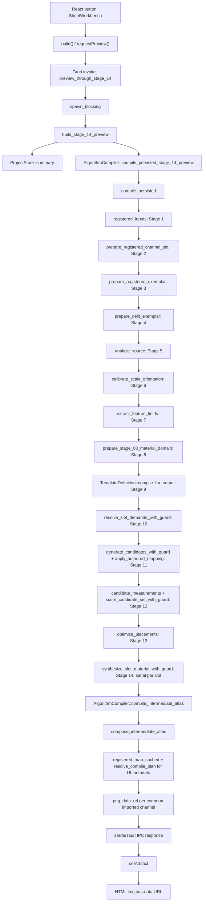

# Hot Trimmer actual runtime pipeline graph

This graph describes the code executed by the current **Preview through Stage 14** action. It is not the intended twenty-stage architecture. Source references are repository-relative and use inclusive line ranges.

## Actual call graph



## Node inventory

| Node | File and symbol | Input → output | Runtime/thread | UI blocking | I/O | Large allocation | Cache | Cancellation |
|---|---|---|---|---|---|---|---|---|
| UI action | `apps/desktop/src/source-first-app.tsx:1651-1704`, `SheetWorkbench` | React props → click | WebView UI thread | The event loop is not synchronously blocked, but the action is disabled while `activity !== idle` | No | No | No | No direct cancel control |
| UI orchestration | `apps/desktop/src/source-first-app.tsx:621-652`, `build`; `702-718`, `requestPreview` | `ProjectProjection`/revision → `IntermediateAtlasProjection` | WebView async task | Awaited; old atlas remains until completion | IPC | Response strings can be multi-megabyte | No artifact cache | UI draft counter discards a late response, but does not itself stop native work |
| Native command | `apps/desktop/src-tauri/src/document_commands.rs:1001-1013`, `preview_through_stage_14` | `Stage14PreviewRequest` → projection | Tauri async runtime | No synchronous WebView block | No direct file I/O | Small | `latest_draft_id` only | A new invocation supersedes the previous job |
| CPU boundary | `apps/desktop/src-tauri/src/document_commands.rs:1007-1012`, `spawn_blocking` | Closure → joined result | Tauri blocking pool | No | No | No | No | Join is awaited; panic becomes user-facing error |
| Snapshot/orchestration | `apps/desktop/src-tauri/src/document_commands.rs:1193-1261`, `build_stage_14_preview` | shared session + revision → projection | Blocking worker plus one 20 ms monitor thread | No WebView block | SQLite reads through `ProjectStore::summary` | Clones the full `ProjectSummary`, including owned source bytes | No snapshot cache | Revision/job monitor works during compilation; post-compile encoding is not cancellable |
| Project snapshot | `crates/project-store/src/lib.rs:430-441`, `summary`; `1346-1387`, `summary_from_connection` | SQLite connection → `ProjectSummary` | Blocking worker | No | SQLite; owned blobs are loaded by source loaders | Potentially source-sized | SQLite/page cache only | None |
| Compiler façade | `crates/sheet-compiler/src/persisted_pipeline.rs:82-109`, `compile_persisted_stage_14_preview` | persisted request → `IntermediateAtlasArtifact` | Same worker plus one 2 ms cancellation monitor | No | No | Token objects only | No | Propagates cancellation into image and render tokens |
| Persisted pipeline | `crates/sheet-compiler/src/persisted_pipeline.rs:113-247`, `compile_persisted` | `ProjectSummary` → artifact | Single blocking worker | No | Source reads for external references | Owns all domain, candidate, slot, and atlas artifacts until return | Deduplicates domains only by `source_set_id|patch_id` within one invocation | Checks between stages and through guarded loops |
| Source bytes/registration | `crates/sheet-compiler/src/persisted_pipeline.rs:534-550`, `registered_inputs` | `StoredSource[]` → `RegisteredChannelSet` + encoded byte map | Worker | No | `fs::read` for external sources; clones owned bytes | Encoded source clone per domain | None | Only subsequent Stage 2 observes cancellation |
| Stage 2 | `crates/image-io/src/normalization.rs:409-450`, `prepare_registered_channel_set` | registration + encoded bytes → `PreparedChannelSet` | Worker | No | Decode from memory | Decoded planes and mip pyramids | Computes a cache key but this runtime does not use a `PreparedChannelCache` | Row/channel checks; decode itself is bounded |
| Stages 3-8 | `crates/sheet-compiler/src/persisted_pipeline.rs:273-340`, `build_domain` | prepared channels → `DomainArtifacts` | Worker, serial | No | No | Rectified planes, analysis fields, domain planes | New `MaterialDomainCache::default()` per domain; no cross-run reuse | Render token checked by implementations |
| Stage 9 | `crates/sheet-compiler/src/persisted_pipeline.rs:146-152`; `crates/domain/src/templates/mod.rs:190-225` | persisted template snapshot → compiled topology | Worker | No | JSON parse from in-memory snapshot | Slot vector only | No | Only before/after stage |
| Stages 10-12 | `crates/sheet-compiler/src/persisted_pipeline.rs:154-205` | topology/domain/analysis → placement inputs | Worker, slots serial | No | No | Candidate sets and field scans | No | Guarded Stage 10-12 loops |
| Stage 13 | `crates/sheet-compiler/src/persisted_pipeline.rs:206-210`; `crates/placement-solver/src/optimizer.rs:284-350` | all scored slot candidates → `PlacementPlan` | Worker, serial beam search | No | No | Beam states and pair cache | Pair cache is per invocation | Checks cancellation inside search |
| Stage 14 | `crates/sheet-compiler/src/persisted_pipeline.rs:212-228`; `crates/sheet-compiler/src/slot_synthesis.rs:115-167` | one `SamplingPlan` + domain → `SynthesizedSlotMaterial` | Worker; 53 slots serial | No | No | Per-slot correspondence, validity, and every imported channel | No | Per output row and channel |
| 14P composition | `crates/sheet-compiler/src/algorithm_compiler.rs:75-85`; `crates/sheet-compiler/src/intermediate_atlas.rs:100-206` | topology + placement + rendered slots → atlas | Worker, serial | No | No | Full atlas RGBA per common channel, `f32x2` correspondence, validity; hashes reread every slot pixel | No | Per slot and revision |
| UI metadata resolution | `apps/desktop/src-tauri/src/document_commands.rs:1233-1250` | project sources + document → resolved regions | Worker | No | May decode sources through `registered_map_cached` | One decoded RGBA source on cache miss | `PreviewService.decoded_sources`, keyed by SHA-256 | Not cancellable |
| Encoding | `apps/desktop/src-tauri/src/document_commands.rs:1238-1242`, `1751-1761`, `png_data_url` | cloned atlas RGBA → PNG base64 string | Worker | No | In-memory only | Full RGBA clone + PNG + base64 | No encoded-map cache | Not cancellable |
| IPC | `packages/ipc-contracts/src/document-contracts.ts:279-315` | Rust projection → JSON object | Tauri/WebView boundary | Serialization/deserialization must finish before React receives it | Process IPC | Base64 expands PNG by about 4/3 | No | No |
| Display | `apps/desktop/src/source-first-app.tsx:1668-1679`, `1737-1756` | selected data URL → `` and HTML overlays | WebView UI/compositor | Decode/upload occurs after response; no progressive result | Browser decodes data URL | Browser image/texture | Browser-local only | Stale artifacts are rejected by revision/hash checks, not cancelled during decode |

### Algorithm-stage node inventory

All rows below execute on the same Tauri blocking worker. None synchronously blocks the WebView thread, but the UI receives no partial artifact, so every row is on the time-to-first-preview critical path. Stage 1 can read external files; Stages 2-14 perform no direct file I/O.

| Stage node | File and symbol | Input → exact output | Large-buffer behavior | Cache in this path | Cancellation |
|---|---|---|---|---|---|
| 1 | `crates/sheet-compiler/src/persisted_pipeline.rs:281-297,534-550`, `registered_inputs` | `StoredSource[]` → `RegisteredChannelSet` + encoded-byte map | Clones owned encoded blobs per domain, or allocates `fs::read` results | None | No check inside registration |
| 2 | `crates/sheet-compiler/src/persisted_pipeline.rs:293-297`; `crates/image-io/src/normalization.rs:409-450`, `prepare_registered_channel_set` | registered channels + encoded bytes → `PreparedChannelSet` | Decoded role planes and mip pyramids | Output has a cache key, but no prepared-channel cache is supplied | Image cancellation token; row/channel checks |
| 3 | `crates/sheet-compiler/src/persisted_pipeline.rs:298-316`, `prepare_registered_exemplar` | prepared channels + patch/full-frame request → `PreparedExemplar` | Rectified planes at patch/full-source resolution | No session cache used | Render token in the implementation |
| 4 | `crates/sheet-compiler/src/persisted_pipeline.rs:317-319`, `prepare_delit_exemplar` | prepared exemplar + delighting settings → delit `PreparedExemplar` | Another set of channel planes | Explicit cache argument is `None` | Render token |
| 5 | `crates/sheet-compiler/src/persisted_pipeline.rs:320-322`, `analyze_source` | delit exemplar → `SourceAnalysisReport` | Analysis summaries plus working planes | Explicit cache argument is `None` | Render token |
| 6 | `crates/sheet-compiler/src/persisted_pipeline.rs:323-325`, `calibrate_scale_orientation` | exemplar + Stage 5 + calibration → `ScaleOrientationReport` | Orientation/scale fields and working memory | None | Render token |
| 7 | `crates/sheet-compiler/src/persisted_pipeline.rs:326-327`, `extract_feature_fields` | exemplar + Stage 6 → `FeatureFieldReport` | Multiple full-resolution feature fields; measured dominant allocation/compute stage | None | Render token |
| 8 | `crates/sheet-compiler/src/persisted_pipeline.rs:328-340`, `prepare_stage_08_material_domain` | Stage 4/5/6/7 artifacts + route request → `PreparedMaterialDomain` | Full domain channel/correspondence/validity planes | A new empty `MaterialDomainCache` is created for each call | Render token |
| 9 | `crates/sheet-compiler/src/persisted_pipeline.rs:146-152`; `crates/domain/src/templates/mod.rs:190-225`, `compile_for_output` | persisted template JSON + output size → `CompiledTemplateTopology` | Small slot/topology vectors | None | Only the surrounding pre/post-stage check |
| 10 | `crates/sheet-compiler/src/persisted_pipeline.rs:154-165`, `resolve_slot_demands_with_guard` | topology-derived `SlotDemandIntent[]` → `ResolvedSlotDemandSet` | Small per-slot demand vector | None | Guard callback |
| 11 | `crates/sheet-compiler/src/persisted_pipeline.rs:166-183`, `generate_candidates_with_guard`, `apply_authored_mapping` | mapped domain + demand + evidence → `CandidateSet` | Up to 96 candidates per slot plus a per-call unusable-pixel integral image | None | Guard callback during generation; authored-filter pass has no internal check |
| 12 | `crates/sheet-compiler/src/persisted_pipeline.rs:182-204`, `candidate_measurements`, `score_candidate_set_with_guard` | candidate set + field measurements → `ScoredCandidateSet` | Repeated rectangle scans; retains top 16 per slot | None | Guard callback during scoring; measurement scans have no explicit check |
| 13 | `crates/sheet-compiler/src/persisted_pipeline.rs:206-210`; `crates/placement-solver/src/optimizer.rs:284-350`, `optimize_placements` | 53 `PlacementSlotInput`s → `PlacementPlan` containing per-slot `SamplingPlan`s | Beam states and pairwise cache; measured 8.49 s | Pair cache only for this invocation | Placement cancellation token inside search |
| 14 | `crates/sheet-compiler/src/persisted_pipeline.rs:212-222`; `crates/sheet-compiler/src/slot_synthesis.rs:113-179`, `synthesize_slot_material_with_guard` | one exact sampling plan + prepared domain + allocation size → `SynthesizedSlotMaterial` | Per-slot channel, correspondence, and validity planes retained until 14P composition | None | Guard callback per output row/channel |
| 14P | `crates/sheet-compiler/src/persisted_pipeline.rs:223-247`; `crates/sheet-compiler/src/intermediate_atlas.rs:100-206`, `compose_intermediate_atlas` | topology + placement + all Stage 14 results → `IntermediateAtlasArtifact` | Full atlas per common channel plus full correspondence and validity; hashes all slot pixels | None | Revision/cancellation checks between slots, not inside the final PNG encoder |

## Important alternate paths that are not in Stage 14P

- `compile_trim_sheet_document_impl` calls `AlgorithmCompiler::compile`, which always rejects Stage 1 (`apps/desktop/src-tauri/src/document_commands.rs:1274-1315`; `crates/sheet-compiler/src/algorithm_compiler.rs:47-73`). It cannot produce final pixels.
- The older bounded preview command and incremental cache are behind `#[cfg(any())]` and therefore do not compile (`apps/desktop/src-tauri/src/document_commands.rs:1317-1400`).
- The old document compositor contains source crop, structural height/normal, roughness/AO, and Region ID code, but `compile_document` is crate-private and unused, while its preview caller is compiled out (`crates/sheet-compiler/src/document_compiler.rs:200-315`, `318-419`, `670-705`). Compiler warnings confirm these symbols are dead in the current build.
- The older template renderer is entirely inside `#[cfg(any())]` (`crates/sheet-compiler/src/lib.rs:18-90`).
- The nominal GPU preview crate contains only a constant and has no caller (`crates/preview/src/lib.rs:1-3`). There is no current preview mesh, UV-island assignment, `wgpu` upload, or PBR material binding.

## Asynchronous and cancellation sequence

```mermaid
sequenceDiagram
    participant UI as React/WebView
    participant TA as Tauri async
    participant W as blocking worker
    participant M1 as revision monitor (20 ms)
    participant M2 as token monitor (2 ms)
    UI->>TA: invoke(preview_through_stage_14, revision)
    TA->>W: spawn_blocking(build_stage_14_preview)
    W->>M1: start scoped monitor
    W->>M2: start scoped monitor
    W->>W: Stages 1-14 and 14P, serial hot path
    Note over UI,W: A newer invocation increments latest_draft_id; monitors make guards false
    W->>W: resolve metadata, clone maps, PNG encode, base64
    Note over W: Encoding has no cancellation check
    W-->>TA: IntermediateAtlasProjection
    TA-->>UI: JSON/base64 response
    UI->>UI: revision/hash check, setArtifact, image decode/display
```

## Bottom line

The real preview is a two-dimensional Base Color (plus only those imported channels present in every required slot) atlas shown in an HTML image. It is not a mesh preview and it does not consume profiles, generated height, generated normal, generated roughness/AO, weathering, an effect plan, Region ID, mips, or an export artifact.
